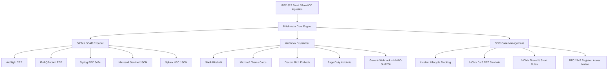

# PhishNetra — Enterprise SIEM/SOAR, Alert Webhooks, SOC Case Management & Email Ingestion

**Document Version:** 1.0.0  
**Milestone:** Milestone 8 / Phase 8  
**Scope:** Multi-Format SIEM/SOAR Log Exporters, Real-Time Incident Webhooks, SOC Case Management & Incident Response Workbench, RFC 822 Email Phishing Analysis, and Defanged Raw IOC Extraction.

---

## 1. Executive Architecture Overview

PhishNetra Milestone 8 equips security teams with enterprise-grade interoperability, bridging real-time threat intelligence directly into existing Security Operations Center (SOC) pipelines, Security Information and Event Management (SIEM) systems, and Security Orchestration, Automation, and Response (SOAR) workflows.



---

## 2. Core Capabilities & Components

### 2.1 Multi-Format SIEM / SOAR Exporter (`SIEMExportEngine.ts`)
Converts analyzed threats and clustered campaigns into standardized industry formats:
- **ArcSight CEF (Common Event Format v0.1):** `CEF:0|PhishNetra|ThreatMitigation|2.0|THREAT_DETECTED|...|src=... act=BLOCKED cs1=PHISHING`
- **IBM QRadar LEEF (Log Event Extended Format v2.0):** `LEEF:2.0|PhishNetra|ThreatMitigation|2.0|THREAT_DETECTED|devTime=...|sev=...|src=...`
- **Syslog RFC 5424:** `<134>1 2026-10-08T... phishnetra.soc PhishNetra - [phishnetraEvent@58744 threat="PHISHING"]`
- **Microsoft Sentinel JSON:** Azure Log Analytics Custom Log schema with normalized timestamps, confidence scores, and structured IOC lists.
- **Splunk HTTP Event Collector (HEC):** Splunk native JSON event encapsulation with `sourcetype="phishnetra:threat:intel"`.

#### Live Feed Endpoint
- `GET /api/siem/feed?format=CEF&limit=50`: Continuous polling endpoint for enterprise log collectors (Logstash, Fluentd, Cribl Stream).

---

### 2.2 Multi-Channel Webhook Dispatcher (`WebhookNotificationService.ts`)
Dispatches immediate, formatted alert payloads when critical threats, brand impersonations, or clustered campaigns are detected:
- **Slack:** Rich BlockKit cards with severity badges, domain metrics, and quick drill-down buttons.
- **Microsoft Teams:** Adaptive Card with fact matrices and SOC direct action triggers.
- **Discord:** Embed with color-coded severity strips (Rose for Critical, Amber for High).
- **PagerDuty:** PagerDuty Events API v2 format for automatic incident paging.
- **Generic HTTP Webhook:** Full JSON payload signed with cryptographic **HMAC-SHA256** headers (`X-PhishNetra-Signature: sha256=...`) for tamper-proof verification.

---

### 2.3 SOC Case Management & Remediation Workbench (`CaseManagementService.ts`)
Enables tier 1-3 SOC analysts to triage, track, and remediate attacks within a unified dashboard:
- **Case Lifecycle:** Transitions through `OPEN` → `INVESTIGATING` → `CONTAINED` → `RESOLVED` / `FALSE_POSITIVE`.
- **Immutable Timeline & Analyst Notes:** Records every action, assignment, status change, and internal comment.
- **Automated 1-Click Defense Generation:**
  - **DNS Sinkhole (BIND9 RPZ):** Generates Response Policy Zone configuration:
    ```bind9
    ; PhishNetra DNS RPZ Sinkhole Rule
    malicious-domain.com CNAME .
    *.malicious-domain.com CNAME .
    ```
  - **Firewall Block Rules (iptables / Snort):**
    ```bash
    # Linux iptables block
    iptables -A FORWARD -d 192.0.2.1 -j DROP
    iptables -A OUTPUT -d 192.0.2.1 -j DROP
    ```
  - **RFC 2142 Registrar Abuse Notice:** Formulates legally sound, timestamped takedown notices for domain registrars, hosting providers, and cloud CDNs.

---

### 2.4 RFC 822 Email Phishing Scanner & Defanged IOC Ingestion (`EmailIngestionService.ts`)
- **Email Parser:** Ingests raw `.eml` files or RFC 822 text, parsing headers (`From`, `To`, `Subject`, `Reply-To`, `Return-Path`, `Authentication-Results`).
- **SPF/DKIM/DMARC Spoof Detection:** Flags header mismatch, `dmarc=fail`, `spf=softfail`, and sender address forging.
- **Defanged IOC Extractor:** Handles security defanging conventions:
  - `hxxp://` / `hxxps://` → `http://` / `https://`
  - `example[.]com` → `example.com`
  - `192[.]168[.]1[.]1` → `192.168.1.1`
  - Strips brackets around `@` signs in email addresses.
- **Recursive Link Evaluation:** Automatically submits extracted URLs to the PhishNetra multi-layer analysis engine to compute a holistic phishing risk score for the entire email message.

---

## 3. Web UI Interfaces

1. **SIEM & Webhooks Console (`/siem`, `/integrations`):**
   - Live format selector (CEF, LEEF, RFC5424, Sentinel, Splunk) with syntax-highlighted code viewer and copy/download controls.
   - Webhook configuration manager with modal editor, secret token generation, and one-click test dispatch.
   - Real-time Webhook Delivery Log table showing HTTP response codes, latency, and status.

2. **SOC Case Management (`/cases`):**
   - Filterable case drawer with status tabs (`ALL`, `OPEN`, `INVESTIGATING`, `CONTAINED`, `RESOLVED`).
   - Deep case view with linked analysis, IOC pills, analyst notes thread, and 1-click remediation generator modal.

3. **Email & Raw IOC Ingestion Studio (`/email-scanner`):**
   - Tabbed view for RFC 822 Email Parsing and Unstructured Raw Text IOC Extraction.
   - SPF/DKIM/DMARC security alignment meters and spoofing warning banners.
   - Extracted URL risk matrix and consolidated email phishing score gauge.

---

## 4. Verification & Automated Test Coverage

The enterprise integrations suite is covered by end-to-end automated unit and integration tests:
- `tests/enterprise_integrations.test.ts`: 11 integration tests covering CEF/LEEF exports, Webhook dispatch & logs, Case creation & remediation generators, and EML parsing.
- **Total Project Test Baseline:** 140 automated tests passing (70 Jest API tests across 15 suites, 12 Extension tests, 58 Pytest ML tests).
