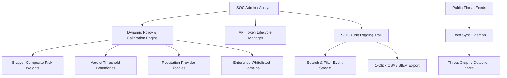

# PhishNetra — Enterprise Governance, Calibration, Audit Trail & Threat Feeds

**Document Version:** 1.0.0  
**Milestone:** Phase 9 / Milestone 9  
**Scope:** Dynamic Multi-Layer Risk Engine Calibration, Enterprise SOC Audit Trail, Threat Intelligence Feed Synchronization, API Token Governance, and Unified UI Architecture.

---

## 1. Executive Overview

Milestone 9 elevates PhishNetra from an automated detection engine into an enterprise governance platform. It provides SOC administrators with real-time policy calibration controls, immutable audit logging, threat feed synchronization daemons, API key lifecycle management, and a clean, categorized user experience.

---

## 2. Core Capabilities

### 2.1 Dynamic Multi-Layer Risk Engine Calibration (`SettingsService.ts` / `/api/settings`)
- **8-Layer Weight Tuning:** Allows real-time mathematical tuning of URL, Domain, DNS, TLS, Reputation, ML, Content, and Brand weights.
- **Dynamic Normalization:** Automatically rebalances weights to 100% composite scale during active evaluation.
- **Verdict Threshold Tuners:** Configurable cut-off boundaries for `SAFE` (default ≤ 35), `SUSPICIOUS` (35–70), and `PHISHING` (> 70).
- **1-Click Auto-Balance & Factory Reset:** Rebalance weights proportionally or restore original factory baseline with one click.
- **Persistent Whitelist Management:** Domain tags that bypass threat alerts for verified enterprise portals.

### 2.2 SOC Audit Logging & Compliance (`AuditLogService.ts` / `/api/audit-logs`)
- **Event Categories:** `AUTH`, `ANALYSIS`, `CASE`, `REMEDIATION`, `CONFIG`, `THREAT_FEED`, `MLOPS`, `SECURITY`.
- **Severity Levels:** `INFO`, `WARNING`, `CRITICAL`.
- **Audit Attributes:** Timestamp, actor identification, action code, target resource, details summary, client IP address.
- **CSV Export:** Streamable CSV download endpoint for compliance audits and external security archiving.

### 2.3 Threat Intelligence Feed Synchronization (`FeedSyncService.ts` / `/api/feeds`)
- **Integrated Feeds:**
  - `URLHAUS` (abuse.ch real-time malicious URLs)
  - `OPENPHISH` (Global phishing intelligence feed)
  - `PHISHTANK` (Verified community submission stream)
  - `CISA_KEV` (Known Exploited Vulnerabilities catalog)
- **Deduplication Engine:** Ingests, normalizes, and deduplicates incoming IOCs into the system graph.
- **Sync Metrics:** Tracks duration in milliseconds, total records fetched, new IOCs added, and duplicate collision rates.

### 2.4 API Token Governance (`/api/settings/api-keys`)
- **Token Generation:** Generates cryptographically secure Bearer tokens (`phish_live_<hex>`) with SHA-256 server-side hashing.
- **Role Assignment:** Configurable `ANALYST`, `ADMIN`, or `USER` permission tiers with optional expiration timeframes.
- **One-Click Revocation:** Instantly invalidates compromised or decommissioned service tokens.

---

## 3. UI Component Architecture Upgrade (`apps/web`)

1. **Mega-Dropdown & Categorized Header (`Navbar.tsx`):**
   - 🔍 **Detection & Ingestion:** Live Scan (`/analyze`), Batch Scanner (`/batch`), Email Scanner (`/email-scanner`), Domain Dossier (`/domains`).
   - 🌐 **Threat Intelligence:** Threat Graph (`/graph`), Threat Campaigns (`/campaigns`), Threat Feeds (`/feeds`), Community Reports (`/reports`).
   - 🛡️ **SOC Operations & SIEM:** SOC Cases (`/cases`), SIEM & Webhooks (`/siem`), Audit Logs (`/audit-logs`).
   - 🧠 **MLOps & AI Lab:** MLOps Dashboard (`/mlops`).
   - ⚙️ **Direct Policy Settings:** System Settings (`/settings`).
   - **Responsive Mobile Drawer:** Clean slide-down category navigation on mobile/tablet viewports.

2. **Global Toast Notification System (`ToastContext.tsx`):**
   - Non-blocking, animated glassmorphism toast alerts (`success`, `warning`, `error`, `threat`, `info`) with auto-dismiss timers replacing disruptive native dialogs.

3. **System Settings Studio (`SettingsPage.tsx` / `/settings`):**
   - Interactive weight sliders with real-time percentage distribution bar.
   - Threshold range sliders with live verdict preview.
   - Reputation provider toggle switches.
   - Interactive whitelist tag manager.
   - API key generation modal with secret copy action.

4. **SOC Audit Logs Page (`AuditLogsPage.tsx` / `/audit-logs`):**
   - Category filtering pills, severity dropdown, search box, and CSV export.

5. **Threat Feeds Synchronization Page (`FeedSyncPage.tsx` / `/feeds`):**
   - Feed status cards, live IOC counters, 1-click sync buttons, and sync history table.

---

## 4. Automated Verification

- **API Test Suite:** 16 suites, 79 tests passing (including `governance_settings.test.ts`).
- **Python ML Test Suite:** 58 tests passing.
- **Browser Extension Test Suite:** 12 tests passing.
- **Total Test Baseline:** 149 / 149 automated tests passing (100% pass rate).
