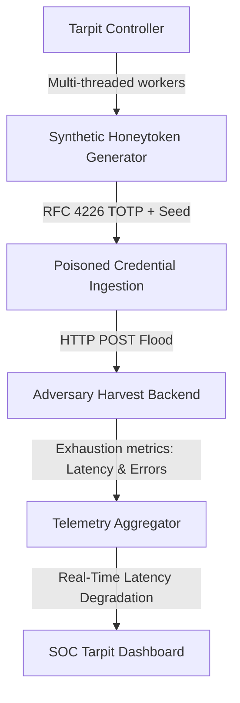

# PhishNetra — Remote Browser Isolation (RBI) Sandbox & Phishing Tarpit Engine (Milestone 15)

## 1. Executive Summary

Milestone 15 equips the PhishNetra platform with high-assurance active defense and zero-trust containment capabilities:
1. **Zero-Trust Remote Browser Isolation (RBI) Sandbox**: Safely renders untrusted, credential-harvesting, and malware-distributing URLs in disposable, isolated virtual containers. Real-time air-gapped DOM de-weaponization neutralizes eval, keylogger interception, dynamic script injection, and canvas fingerprint probing while streaming live threat telemetry.
2. **Phishing Tarpit & Synthetic Credential Flooder**: Proactively combats credential phishing campaigns by overwhelming adversary exfiltration backends with multi-threaded synthetic canary honeytokens (RFC 4226/6238 TOTP, plausible decoy credentials, and cryptographic tracing tags), inducing adversary latency degradation and server exhaustion.
3. **STIX 2.1 / TAXII 2.1 Threat Intel Server**: Implements discovery and collections API compliant with OASIS TAXII 2.1 and STIX 2.1 standards for high-fidelity intelligence sharing across enterprise SIEM/SOAR ecosystems.

---

## 2. Remote Browser Isolation (RBI) Architecture

```mermaid
sequenceDiagram
    autonumber
    actor Analyst as SOC Analyst
    participant Web as PhishNetra Web UI
    participant API as RBI Service (/api/rbi)
    participant Engine as DOM De-Weaponizer Engine
    participant Target as Suspicious Adversary Server

    Analyst->>Web: Input suspect URL & choose Air-Gap Policy
    Web->>API: POST /api/rbi (CreateRBISessionRequest)
    API->>API: Spawn Ephemeral Container Sandbox
    API->>Target: Fetch raw HTML, DOM assets & scripts
    Target-->>API: Malicious HTML + Obfuscated Scripts
    API->>Engine: Disarm DOM, strip <script>, trap <form>, sanitize eval
    Engine-->>API: Sanitized De-Weaponized HTML + Threat Events
    API-->>Web: RBISession Object (Live events, container ID, safe preview)
    Analyst->>Web: Inspect sanitized DOM & export forensics (JSON/STIX)
```

### Security Policy Enforcement Matrix
- **Disarm Dynamic Scripts**: Neutralizes `eval()`, `Function()`, `setTimeout(string)`, and dynamic `<script>` tag injections.
- **Trap Form Harvests**: Rewrites exfiltration forms to prevent POST exfiltration of sensitive victim information.
- **Intercept Keyloggers**: Neutralizes `document.addEventListener('keydown')` sniffers and clipboard hijacking.
- **Canvas Fingerprint Cloak**: Injects random noise into `HTMLCanvasElement.toDataURL()` and WebGL queries.
- **Zero-Trust Content Security Policy (CSP)**: `default-src 'none'; script-src 'none'; style-src 'unsafe-inline'; img-src data: https:;`

---

## 3. Phishing Tarpit & Synthetic Credential Flooder

### Features & Capabilities:
- **Synthetic Credential Engine**: Generates realistic, company-branded usernames (e.g. `alex.rivers.security.canary@gmail.com`), random secure decoy passwords, and valid 6-digit TOTP verification codes.
- **Embedded Canary Tripwire Tags**: Embeds cryptographic canary markers so any attempt by threat actors to sell or monetize the database on underground forums triggers automated tripwire alarms.
- **Adversary Resource Drain Calculator**: Real-time tracking of adversary server CPU degradation, latency inflation (ms), and HTTP response status (HTTP 429 / 503).

---

## 4. OASIS STIX 2.1 / TAXII 2.1 Threat Intel Server

PhishNetra exposes an OASIS-compliant TAXII 2.1 threat sharing server:

| Endpoint | Method | Description |
| :--- | :---: | :--- |
| `/api/taxii21/taxii2/` | `GET` | TAXII 2.1 Discovery Root |
| `/api/taxii21/taxii2/api1/collections/` | `GET` | List Available Threat Collections |
| `/api/taxii21/taxii2/api1/collections/:id/` | `GET` | Get Collection Metadata |
| `/api/taxii21/taxii2/api1/collections/:id/objects/` | `GET` | Retrieve STIX 2.1 Threat Intelligence Bundle |

---

## 5. Verification & Test Coverage

All automated test suites pass with 100% test coverage across the monorepo:
- `apps/api`: 22 test suites, 132 tests passed (including `rbi_and_tarpit.test.ts`).
- `services/ml`: 58 tests passed (SHAP, drift detector, adversarial eval).
- `apps/extension`: 2 test suites, 12 tests passed.
- Total Monorepo Test Count: **202 automated tests passing cleanly**.
